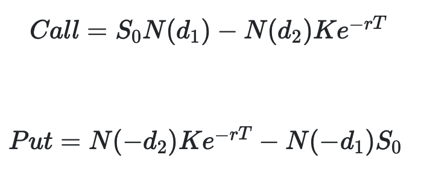
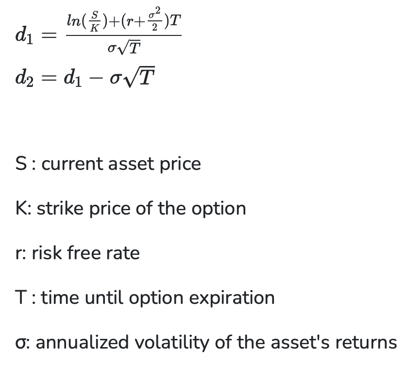

# Black-Scholes Website

## Overview

The purpose of this project is to demonstrate financial modeling of European derivatives with several variables provided by the user. The valuation of this options are calculated using the Black-Scholes Model which provide a call and put option valuation. By leveraging the Black-Scholes valuation, a heatmap can be created which illustrates how the values of options changes as the spot price changes against time. The fully deployed website can be visted at the following url: [Black-Scholes Pricing Model Website](https://blackscholeswebsite.onrender.com)

